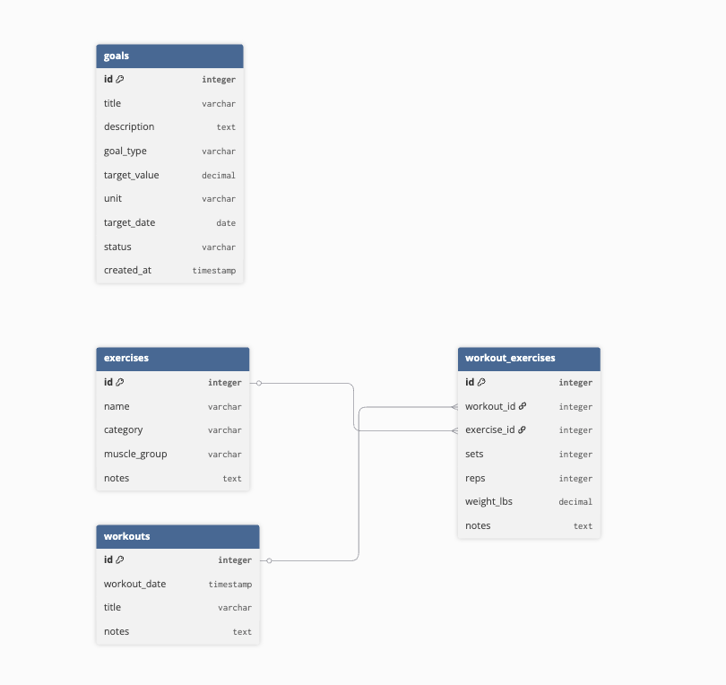

# Personal Workout Tracker

A personal workout tracking web application built with Streamlit and PostgreSQL. Log your gym sessions, track exercises with sets/reps/weight, set fitness goals, and view your workout history over time.

**Live App:** https://workout-tracker-h3c5geuy4zwdvrqo4brkx6.streamlit.app/

---

## ERD



---

## Table Descriptions

**exercises** — A library of exercises the user can log. Stores the exercise name, category (Push/Pull/Legs/Cardio), and muscle group. This table powers the dynamic dropdowns in the Log Workout page.

**workouts** — Represents each individual gym session. Stores the date, an optional title, and session notes.

**workout_exercises** — The junction table connecting workouts and exercises (many-to-many). Each row represents one exercise performed in one workout, storing sets, reps, and weight lifted.

**goals** — Personal fitness goals with a target value, unit, deadline, and status (active/achieved/abandoned).

---

## Pages

- **Home** — Dashboard showing total workouts, exercises used, volume lifted, and active goals
- **Exercise Library** — Add, edit, search, and delete exercises from your personal library
- **Log Workout** — Log a workout session by adding exercises with sets, reps, and weight
- **My Goals** — Add and track fitness goals, mark them as achieved
- **Workout History** — Browse and search past workouts with full exercise details

---

## How to Run Locally

1. Clone the repository:
```bash
git clone https://github.com/YOUR_USERNAME/workout-tracker.git
cd workout-tracker
```

2. Install dependencies:
```bash
pip install streamlit psycopg2-binary
```

3. Create a `.streamlit/secrets.toml` file:
```toml
DB_URL = "your-postgresql-connection-url-here"
```

4. Run the app:
```bash
streamlit run Streamlit_app.py
```

---

## Tech Stack

- **Frontend:** Streamlit
- **Database:** PostgreSQL (Neon)
- **Language:** Python
- **Deployment:** Streamlit Community Cloud
